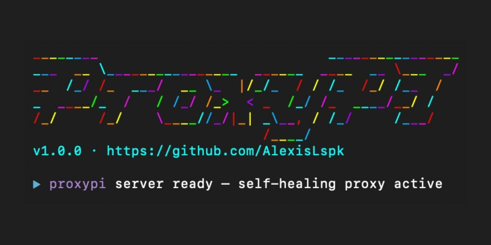

## What it is

Self-healing API proxy MCP for Cursor, Claude Code, or any MCP-compatible client. Send any REST request — if it fails, ProxyPI reads the error, diagnoses the problem using Claude, patches the request, and retries. Successful fixes are remembered and applied instantly next time, without calling Claude.

---

## How it works

```
You: proxypi_request → POST https://api.example.com/users

ProxyPI:  try → fail → diagnose (Claude) → patch → retry → remember
```

Next time the same error occurs on the same host and path, the fix is applied from memory instantly — no Claude call needed.

---

## Demo

```bash
npx proxypi
```

<pre>
<span style="color: #22d3ee">▶</span> <span style="color: #a855f7">proxypi</span>  sending → POST https://api.example.com/users
<span style="color: #f59e0b">⚠</span> <span style="color: #a855f7">proxypi</span>  422 — checking memory for known fix...
<span style="color: #22d3ee">▶</span> <span style="color: #a855f7">proxypi</span>  healing attempt 1 — asking Claude to diagnose...
<span style="color: #22d3ee">▶</span> <span style="color: #a855f7">proxypi</span>  retrying with patch: body uses 'name' but API expects 'full_name'
<span style="color: #22c55e">✔</span> <span style="color: #a855f7">proxypi</span>  healed in 1 attempt — 200 — 1843ms
</pre>

---

## Install

```bash
npx proxypi
```

---

## Config

Add to `.cursor/mcp.json` (project root or `~/.cursor/mcp.json`):

```json
{
  "mcpServers": {
    "proxypi": {
      "command": "npx",
      "args": ["-y", "proxypi"],
      "env": {
        "ANTHROPIC_API_KEY": "your-api-key-here"
      }
    }
  }
}
```

Restart Cursor. Four tools: `proxypi_request`, `proxypi_history`, `proxypi_replay`, `proxypi_clear`.

---

## Tools

| Tool | Description |
|------|-------------|
| `proxypi_request` | Send any REST request — auto-heals on failure |
| `proxypi_history` | View past fixes, filter by API host |
| `proxypi_replay` | Re-run a stored fix to verify it still works |
| `proxypi_clear` | Wipe all healing records from memory |

---

## What ProxyPI can fix

| Error | What ProxyPI does |
|-------|------------------|
| `401 Unauthorized` | Fixes Authorization header format (Bearer vs Basic vs token prefix) |
| `400 Bad Request` | Fixes body field names, types, or missing required fields |
| `422 Unprocessable` | Corrects schema mismatches, enum values, date formats |
| `404 Not Found` | Fixes URL path, API version prefix, trailing slashes |
| `405 Method Not Allowed` | Switches to the correct HTTP method |

---

## More

- **Memory:** Fixes stored in `~/.proxypi/memory.json`
- **Env:** `ANTHROPIC_API_KEY` required (only when using healing — server starts without it)
- **Local dev:** `cp .env.example .env`, add key, then `npm run dev`
- **Tests:** `npm test`

MIT · [GitHub](https://github.com/AlexisLspk/proxypi)
